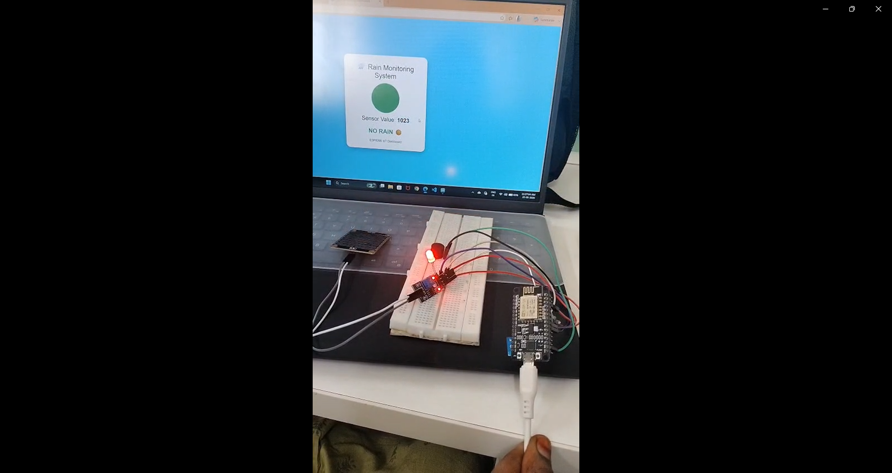

## 🌧️ Rain Detection and Alert System

## Project overview
Developed a rain monitoring system using a rain sensor, LED indicators, and a buzzer.

##Features
✅ Detects rainfall in real time
✅ LED glows when rain is detected
✅ Buzzer provides an alert notification
✅ Simple and cost-effective weather monitoring solution

## Components 
ESP8266 NodeMCU
Rain Sensor Module
LED
Buzzer
Jumper Wires

### Hardware Setup

[Watch Project Demo]
(https://drive.google.com/file/d/197wnLkZMHsHgUQKdQvTjJc4VAr1WA7R1/view?usp=drivesdk)

## Output
When rainwater falls on the sensor plate, the sensor detects moisture. The ESP8266 processes the signal and activates the LED and buzzer to alert the user.
